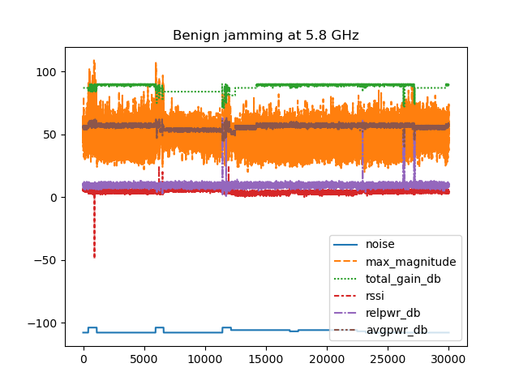
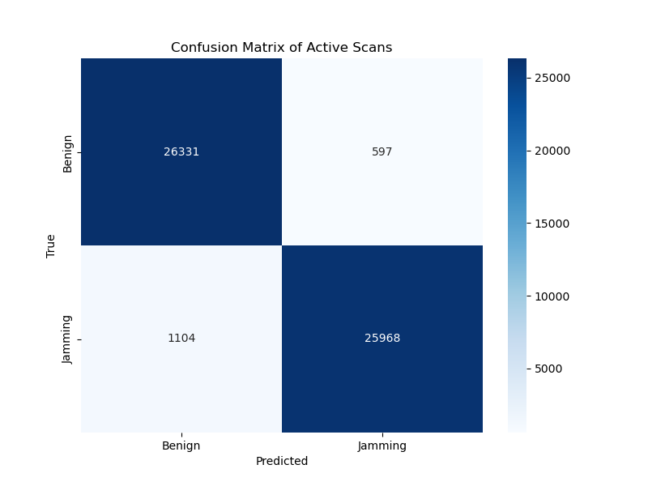

# Predicting and classifying malicious RF signals

## Table of contents
1. [Overview](#overview)
2. [Hypothesis](#hypothesis)
3. [The Data](#the-data)
4. [Visualizations](#visualizations)
5. [Conclusion](#conclusion)

## Overview
The RF spectrum plays a pivotal role in modern communications, and with the increasing prevalence of malicious RF jamming attacks, the reliability and security of wireless systems are under significant threat. To safeguard your critical frequencies, it is essential to accurately detect and identify any disruptions, whether caused by deliberate interference or other factors. This requires robust monitoring and analysis to ensure that your communications remain secure and uninterrupted.

## Hypothesis
## Null Hypothesis
- Received Signal Strength Indicator (RSSI) is NOT a good indicator of malicious jamming

## Alternate Hypothesis
- Received Signal Strength Indicator (RSSI) is a good indicator of whether or not a signal is being maliciously jammed or not.

## The Data
Data Overview: 
- The data was presented in a 14.5 GB zip file, with 96k spectral scans. (5k active scans, 91k passive scans)
- Format: .csv
- Captures instances of RF jamming (malicious) and non-jamming (benign) scenarios using a Raspberry Pi4 device 
- 'Jamming' and 'floor' data were collected in an RF chamber to ensure controlled conditions
- 'Background' data was obtained from real-world environments, with varying interference scenarios to simulate typical usage scenarios
- For the sake of this project, three .csv files were selected from the different scenarios listed above. (Active benign background, active gaussian jamming, passive benign background, and passive gaussian jamming)

Data Features: 
- freq1: Frequency bin 1
- noise: Noise level
- max_magnitude: Maximum magnitude of the signal
- total_gain_db: Total gain in dB
- base_pwr_db: Base power in dB
- rssi: Received signal strength indicator
- relpwr_db: Relative power in dB
- avgpwr_db: Average power in dB
    

## Visualizations

## Metrics
The output from the tests are as follows:

Active Metrics:
- Accuracy:  0.96
- Precision:  0.98
- Recall:  0.96
- F1 Score:  0.97

Passive Metrics:
- Accuracy:  0.90
- Precision:  0.90
- Recall:  0.91
- F1 Score:  0.91

Hypothesis test on RSSI
- Active RSSI T-Statistic: -373.3301409744007
- Active RSSI P-Value: 0.0

- Passive RSSI T-Statistic: -57.16301338058486
- Passive RSSI T-Statistic: 0.0

## Conclusion

After analyzing the metrics and visualizations, it is clear that the logisitic regression model used is very accurate in predicting if signals from this dataset are being maliciously jammed or not. Additionally, the model also shows that it can predict the active gaussian jamming easier than the passive, though not by a large margin. (The active jamming accuracy was 96%, whereas the passive jamming accuracy was 90%.) This leads into the hypothesis test, where I tested to see if the RSSI (Received signal strength indicator) was a good indicator of whether or not a signal is being maliciously jammed. Both tests show that there is a clear relationship in increased RSSI being a tell-tell sign of a signal being maliciously jammed, which is also visualized in the examples above. With all of this being said, we can reject the null hypothesis of RSSI not being a good indicator of malicious jamming. 